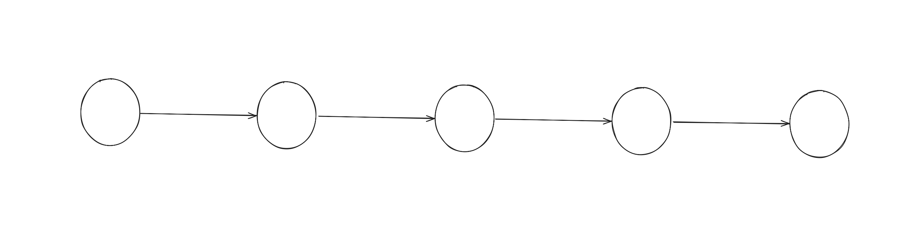

Iterator design pattern, adı üzerinde bir data üzerinde iterasyon (yinelemek, ilerletmek) işleminin yapılmasını sağlayan bir design pattern'dir. Iterate türkçeye yineleme, tekrarlama gibi çevrilse de tam anlamıyla bu işi yapmamaktadır. Iterate denilince akla, liste veya ağaç gibi bir veri türünde birbirine bağlı veya sıralanmış nesneler üzerinde adım adım gezinilebilmesi gelmelidir. Örneğin şekil 1'de görüldüğü üzere en soldaki sıfırıncı index'te (indeks) bulunan veriden sonra sıradaki elemana direkt geçiş yapılması yani iterate edilmesi ile Iterator design pattern uygulanmış olur. 
Yaygın veri tiplerinden biri olan linked-list iterator pattern'i direkt olarak uygulayan bir veri yapısıdır.



Şekil 1. Birbirine bağlı düğümler.

Aşağıdaki gibi `IIterator` interface'i ile `ConcreteIterator` class'ında bulunması gereken temel `HasNext`ve `Next` fonksiyonlarını implement edilmesi sağlanarak, Concrete class içerisinde gerekli implementasyonlar yapılmaktadır.
`HasNext` fonksiyonunda iterate edilebilmesi için bir sonraki adımda herhangi bir node bulunup bulunmadığının kontrolünü sağlamasının implementasyonu gerçekleştirilmiştir. `Next`fonksiyonunda ise eğer bir sonraki adımda node bulunuyorsa iterate işlemini gerçekleştirip sıradaki node'daki değeri geri döndürmesinin implementasyonu yapılmıştır.

```csharp
public interface IIterator
{
    bool HasNext();
    object Next();
}

public class ConcreteIterator : IIterator
{
    private readonly List<object> _items;
    private int _currentIndex = -1;

    public ConcreteIterator(List<object> items)
    {
        _items = items;
    }

    public bool HasNext()
    {
        return _currentIndex + 1 < _items.Count;
    }

    public object Next()
    {
        if (!HasNext())
        {
            throw new InvalidOperationException("No more elements to iterate.");
        }
        _currentIndex++;
        return _items[_currentIndex];
    }
}
```

Sırada, iterate edilmesi istenen bir `Aggregate` class'ının aşağıdaki `IAggregate` interface'ini implemente ederek Iterate işlemlerini desteklenmesini sağlayan ve bütün iteration implementasyonlarının bulunduğu `ConcreteIterator`class'ını döndüren `CreateIterator`fonksiyonunun implementasyonu bulunmaktadır.

```csharp
public interface IAggregate
{
    IIterator CreateIterator();
}

public class ConcreteAggregate : IAggregate
{
    private readonly List<object> _items = new List<object>();

    public void AddItem(object item)
    {
        _items.Add(item);
    }

    public IIterator CreateIterator()
    {
        return new ConcreteIterator(_items);
    }
}
```

Böylece, `ConcreteAggregate` class'ı kendi içerisinde saklanan `_items` dizisinde iterasyon yapılabilir hale dönüşmektedir. 

Ek olarak, List<T> class'ı aslında iterator pattern'i destekleyen bir implementasyona sahiptir. Implemente ettiği `IEnumerable` interface'i ile `IAggregate` aynı implementasyonu sağlar ve yukarıdaki örneğe çok benzer bir implementasyon ile `Enumerator` struct'ını (Yukarıdaki örnekteki ConcreteIterator) döndürür ve iterasyon yapılabilir bir hale bürünür. 

## Kaynakça

Ücretsiz:

- https://source.dot.net/#System.Private.CoreLib/src/libraries/System.Private.CoreLib/src/System/Collections/Generic/List.cs,cf7f4095e4de7646
- https://refactoring.guru/design-patterns/iterator
- https://www.geeksforgeeks.org/system-design/iterator-pattern/
- https://metintopcu1.medium.com/iterator-design-pattern-1d7a04685f9c
- https://medium.com/kodcular/iterator-design-pattern-nedir-aa2df9838145

Ücretli:
- [Desing Patterns: Elements of Reusable Object-Oriented Software Book](https://www.amazon.com.tr/Design-Patterns-Elements-Reusable-Object-Oriented/dp/0201633612/ref=sr_1_2?__mk_tr_TR=%C3%85M%C3%85%C5%BD%C3%95%C3%91&crid=WHUMS0DHJBKO&dib=eyJ2IjoiMSJ9.mTRaTOPYqsPcUsGD8azntQBwoQYmLa7486oAF-n21naeCMl-cWRy6Tc4xyGXPHzIe4pgk3yyBBQ5xXEXy_yChPa8_t7-ZEiWFDxX6xRvYtws2SsECY5g6_L03uQXeOL8hFzn00c2Ccjiq1EKQHmZEb4mUS1O4esM4UrdgbgWi_EB92UbzYH7rBFb5SJsRLxTch6rUKNqSfxO9I9FBaaZQoJbC04f4JZKGyaf1G6QW5xcHb7AJ4gMh3peaP8xz24u7sXUMLs7M8RIAByW4YO97lxJNs2AjFfzRyJTMtZlxpY.xPLI_w471Dn2oGOGQVdfmRuoMEX8cetRTg0iYLmadDo&dib_tag=se&keywords=design+patterns%2C&qid=1752059924&sprefix=design+pattern%2Caps%2C762&sr=8-2)