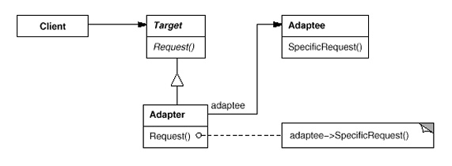

Adapter Pattern, birbiri ile uyumsuz interface'lere sahip class'ların uyumlu bir şekilde çalışması için birbirlerine adapte olmasını sağlar. Bu pattern, bir sınıfın arayüzünü, beklenen başka bir arayüze çevirir. Böylece birbirleriyle uyumsuz olan sınıflar, birlikte çalışabilir.

Örneğin yazlık araba lastiği ile kışın dağa çıkılıyor. yaz lastiği kışın buzlu ve karlı koşullara uyumsuz olduğundan kaynaklı yeterince sürtünme sağlayamayacağı için yol tutuşu sağlıklı olmayacaktır. Bu durumda, aracın lastiğine zincir veya lastik çorabı gibi "Adaptörler" takarak lastikleri ortam koşullarına uygun hale getirebilir ve kışın kullanılabilir hale çevrilebilir. 

Bir diğer örnek, Avrupa, Amerika, Birleşik Krallık gibi bölgelerde elektrik prizlerinin tipleri değişiklik göstermektedir. Avrupa tipli bir kablonun Amerika soketine uyumlu olmadığından direkt olarak takılamamaktadır ancak bir Adaptör/Dönüştürücü sayesinde kullanılabilir hale çevrilebilmektedir. 

Yazılımlarda Adapter, bir diğer adıyla `Wrapper`, mevcut sistemi değiştirmeden yeni özellikler ekleyebilmek, Eski kodları yenilemek zorunda kalmamak, Farklı kütüphaneleri veya API'ları custom projelere adapte etmek gibi çeşitli alanlarda kullanılmaktadır.

Bu yazıda, Adapter Pattern iki örnek üzerinden anlatılacaktır.
- [Gang of Four Design Patterns Kitabındaki Diyagram](#gang-of-four-design-patterns-kitabındaki-diyagram)
- [CAP Kütüphanesinin Custom Bir Projeye Entegrasyonu](#cap-kütüphanesinin-custom-bir-projeye-entegrasyonu)

## Gang of Four Design Patterns Kitabındaki Diyagram



Yukarıdaki görsel üzerinden implementasyon yapılacak olursa `Target` interface'i aşağıdaki gibi implemente edilir.

```csharp
public interface ITarget
{
    void Request<T>();
}
```

Bu interface, custom uygulamada yapılacak işlemleri kullanma biçimi olarak tanımlanmaktadır. Bu biçim `Adaptee` class'ında bulunmadığından kaynaklı custom uygulama ile `Adaptee` class'ının uyumsuz olduğu buradan anlaşılmaktadır.

```csharp
public class Adaptee
{
    public void SpecificRequest(string name)
    {
        Console.WriteLine($"Adaptee: {name} isimli class çağırıldı.");
    }
}
```

`Adaptee` class'ı ilgili implementasyonda string bir argument almaktadır ancak custom uygulamada sadece generic bir fonksiyon bulunmaktadır. Bu iki sistemi birbirine bağlayabilmek için bir `Adapter` class yazıp içeride custom uygulamaya uygun bir implementasyon yapılarak aralarındaki uyumsuzluk giderilmektedir.

```csharp
public class Adapter : ITarget
{
    private readonly Adaptee _adaptee;
    public Adapter(Adaptee adaptee)
    {
        _adaptee = adaptee;
    }

    public void Request<T>()
    {
        _adaptee.SpecificRequest(typeof(T).Name);
    }
}

```

program.cs
```csharp
internal class Program
{
    private static void Main(string[] args)
    {

        Adaptee adaptee = new Adaptee();
        ITarget target = new Adapter(adaptee);

        target.Request<Program>();
    }
}
```

Çıktı
```
Adaptee: Program isimli class çağırıldı.
```

## CAP Kütüphanesinin Custom Bir Projeye Entegrasyonu

CAP kütüphanesi, AMQP protocolü kullanarak outbox pattern ile implemente edilmiş distributed pub/sub mekanizması sunar. Bu mekanizmayı custom uygulamada kullanılması sırasında, uygulamanın isterleri içerisinde `class` bazlı bir pub/sub mekanizması kullanılması istenmektedir. CAP bu mekanizmayı sağlamayıp sadece static string değerler ile işlemini yürütmektedir. 

Bunun için öncelikle `ITarget` görevi görecek olan `ICapTarget` interface'i implemente edildi.

```csharp
public interface ICapTarget
    {
        Task PublishAsync<T>(T message, CancellationToken cancellationToken) where T : MessageBase;
    }
```

Bu interface publish işlemlerinde kullanılacak argument'ın generic parameter olarak alınması gerektiğini ve bu parametrenin `MessageBase` class'ından türemesi gerektiğini ifade etmektedir.

```csharp
public class MessageBase { }
```

```csharp
public class CapAdapter : ICapTarget
{
    private readonly ICapPublisher _capPublisher;
    private readonly IEmopLogger _emopLogger;

    public CapAdapter(ICapPublisher capPublisher, IEmopLoggerFactory emopLoggerFactory)
    {
        _capPublisher = capPublisher;
        _emopLogger = emopLoggerFactory.ForContext<CapAdapter>();
    }

    public async Task PublishAsync<T>(T message, CancellationToken cancellationToken) where T : MessageBase
    {
        _emopLogger.Information($"Publishing message inside Cap Adapter with factory: {typeof(T).Name}");

        await _capPublisher.PublishAsync(typeof(T).Name, contentObj: message, cancellationToken: cancellationToken);
    }
}
```

Yukarıdaki kodda görüldüğü üzere, `ICapPublisher` ile gelen `PublishAsync` methodu string bir name, content ve cancellationToken almaktadır. Önceden bahsedildiği üzere, custom uygulamadaki isterleri karşılayacak şekilde generic parametrenin tipinin name değerini gelen methoda gönderilerek ve message'ın kendisini de içine verilerek custom uygulamayla uyumlu bir şekilde capPublisher'ı kullanılmış olmaktadır. Böylece adapter pattern uygulanmış olup iki interface arasında uyumsuzluklar giderilip kullanılmış olundu. Burada ek olarak loglama da yapılmıştır ancak bu işlem iki interface arasındaki uyumsuzluk problemini çözmediği için `Adapter Pattern` bazında rol almamaktadır.

CAP kütüphanesi özelinde yukarıdaki kodların çalışabilmesi için çeşitli konfigurasyonlar, service registrationlar ve implementasyonlar yapılması gerekmektedir. Bunlara [buradan](https://github.com/Emopusta/adessibinden/tree/master/src/corePackages/Core.EventBus) ulaşılabilir. ve kullanımına da [consumer](https://github.com/Emopusta/adessibinden/blob/master/src/Application/Consumers/ProductGetDetailCounterConsumer.cs) ve [publish edildiği kısıma](https://github.com/Emopusta/adessibinden/blob/f25c6b7f9ad4d89a27831f65cb14e5ccc73dc980/src/Application/Features/PhoneProducts/Queries/GetByIdDetails/GetByIdDetailsPhoneProductQueryHandler.cs#L40) ulaşılabilir.

# Kaynakça

Ücretsiz:
- https://www.youtube.com/watch?v=2PKQtcJjYvc -> Tavsiye edilen
- https://www.youtube.com/watch?v=aRzZYXCjRQk&list=PLRp4oRsit1bzcZhzv-xvHGn1SS0wwLIvR&index=6
- https://www.youtube.com/watch?v=wA3keqCeKtM
- https://refactoring.guru/design-patterns/adapter
- https://medium.com/kodcular/adapter-design-pattern-adapt%C3%B6r-kal%C4%B1b%C4%B1-nedir-302e8206f02b
- https://www.geeksforgeeks.org/system-design/adapter-pattern/


Ücretli:
- [Desing Patterns: Elements of Reusable Object-Oriented Software Book](https://www.amazon.com.tr/Design-Patterns-Elements-Reusable-Object-Oriented/dp/0201633612/ref=sr_1_2?__mk_tr_TR=%C3%85M%C3%85%C5%BD%C3%95%C3%91&crid=WHUMS0DHJBKO&dib=eyJ2IjoiMSJ9.mTRaTOPYqsPcUsGD8azntQBwoQYmLa7486oAF-n21naeCMl-cWRy6Tc4xyGXPHzIe4pgk3yyBBQ5xXEXy_yChPa8_t7-ZEiWFDxX6xRvYtws2SsECY5g6_L03uQXeOL8hFzn00c2Ccjiq1EKQHmZEb4mUS1O4esM4UrdgbgWi_EB92UbzYH7rBFb5SJsRLxTch6rUKNqSfxO9I9FBaaZQoJbC04f4JZKGyaf1G6QW5xcHb7AJ4gMh3peaP8xz24u7sXUMLs7M8RIAByW4YO97lxJNs2AjFfzRyJTMtZlxpY.xPLI_w471Dn2oGOGQVdfmRuoMEX8cetRTg0iYLmadDo&dib_tag=se&keywords=design+patterns%2C&qid=1752059924&sprefix=design+pattern%2Caps%2C762&sr=8-2)
- https://www.udemy.com/course/design-patterns-csharp-dotnet/