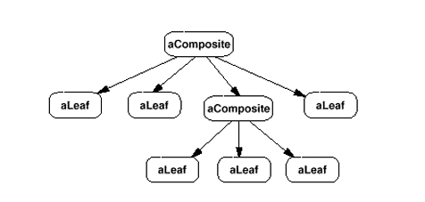
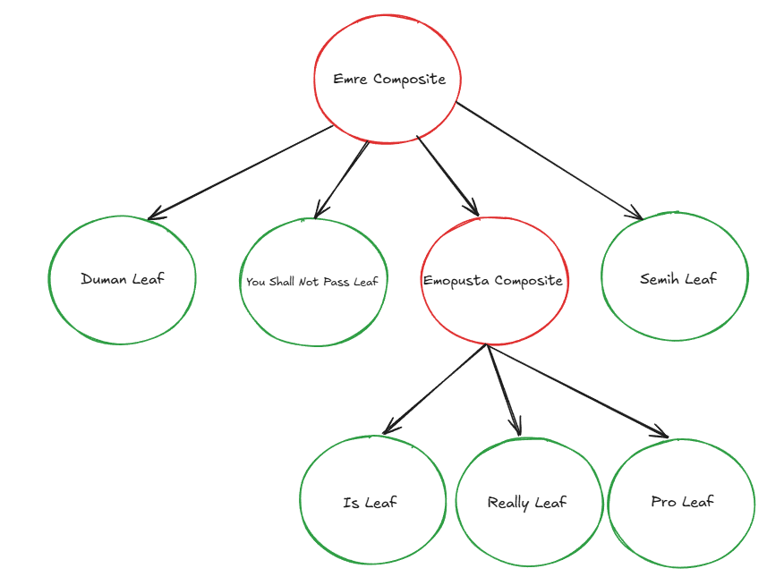
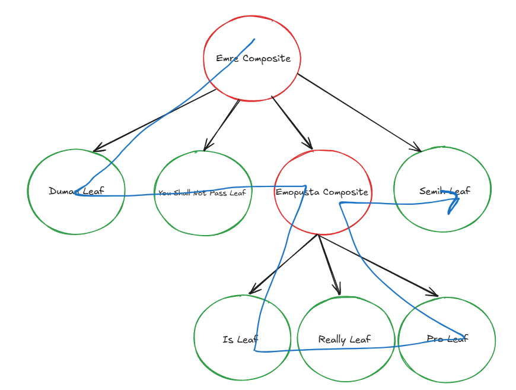

# Composite Design Pattern
# İçerik
- [Giriş](#giriş)
- [Kullanıldığı Alanlar](#kullanıldığı-alanlar)
- [Avantajları](#avantajları)
- [Dezavantajları](#dezavantajları)
- [Bileşenler](#bileşenler)
- [Teorik Örnek](#teorik-örnek)
- [Kaynakça](#kaynakça)


# Giriş
Composite pattern, nesneleri ağaç yapısı şeklinde organize ederek, ağaç yapısındaki alt-üst, yaprak-gövde ilişkisini kurmaya ve bu nesnelerin ortak bir şekilde işlem görebilmesine olanak sağlar. Ağaç yapısındaki her bir node(düğüm) ortak bir interface(arayüz)'e sahip olması gerekmektedir. 

### Kullanıldığı alanlar

Ağaç yapısına benzeyen bütün ortamlarda çeşitli varyasyonları kullanılmaktadır. Bunlar:
- Neural Networks
- HTML DOM elements
- Organizasyon şemaları
- Diyagram oluşturma uygulamaları (Birden çok componenti seçip kaydırmak gibi)

### Avantajları
- kompleks ağaç yapılarını uygun bir şekilde kullanılabilmesiyle, polymorphism (çok biçimlilik) ve recursive (özyineleme) operasyonlar yapılabilmesini sağlar.
- Open-Closed Principle'ına uyar. Yeni nesnelerin eklenmesi, uygulamada herhangi bir yerde kod değişikliğine sebebiyet vermeden yapılabilir.

### Dezavantajları
- Kompleks ve işlevsel olarak birbirinden çok zıt nesnelerin bulunduğu bir durumda, ortak işleri yapabilecek nesnelerin dolayısıyla aynı interface'i kullanacak nesnelerin tespit edilmesi zorlaşacaktır.

Görsel 1'de görüldüğü üzere genel bir ağaç yapısına benzetilen composite patternin görselleştirilmiş halidir. İki çeşit node'dan oluşan bu ağaçta leaf'ler (yaprak) ve composite'ler  bulunmaktadır. Leaf component'leri ağacın en altında bulunan kısımlara denir yani bu parçanın child'ı yoktur. Composite'ler ise aralarda bulunan yani child node'u bulunan node'lardır. Ayrıca Composite'ler alt yapraklarını hatta bazı durumlarda üst yapraklarını da kendi içerisinde saklaması gerekmektedir.

### Bileşenler

**Leaf:**
- Alt elemanı yoktur.
- İşlemin yapılacağı son yerdir.

**Composite:**
- Alt elemanları vardır.
- İşlemi alt elemanlara devreder.
- İşlemin devri sırasında decorate tarzı ek işlemler yapabilir.

**Component (interface):**
- Ortak arayüz

### Teorik Örnek
<br>
Görsel 1. GoF Composite Pattern Diagram

Görsel 1'deki teorik diyagramı kod örneğiyle desteklemek gerekirse öncelikle ortak arayüzün oluşturulması gerekmektedir. `Name` fieldının eklenmesinin sebebi ise, örnek çıktı oluşturulması sırasında leafler arası ayırt etmeyi kolaylaştırmaktır.

```
public interface IComponent
{
    string Name { get; init; }
    void Invoke();
}
```

Bütün node'larda kullanılacak bir fonksiyon olan `Invoke()` methodunu ve `Name` property'sini içeren bir interface oluşturuldu.

Aşağıda bu interface'i implement eden iki adet örnek leaf bulunmaktadır.
```
public class FirstLeaf : IComponent
{
    public string Name { get; init; }
    public FirstLeaf(string name = "Leaf")
    {
        Name = name;
    }
    public void Invoke()
    {
        Console.WriteLine($"{Name} named FirstLeaf Component Invoked!");
    }
}
public class SecondLeaf : IComponent
{
    public string Name { get; init; }
    public SecondLeaf(string name = "Leaf")
    {
        Name = name;
    }
    public void Invoke()
    {
        Console.WriteLine($"{Name} named SecondLeaf Component Invoked!");

    }
}
```

Son olarak da Composite class'lara örnek olarak aşağıdaki gibi bir listede kendi alt componentlerini tutan ve bu listeye ekleme ve çıkarma yardımcı fonksiyonlarını içeren. Ayrıca dikkat edilmesi gereken bir konu olarak `IComponent` interface'inden türeyen bu class, Leaf'lerdeki gibi Invoke methodunu içeriyor ve ana amacı olan bütün leaf'lerindeki `Invoke` methodunu bir döngüde çağırarak implementasyonu tamamlanmıştır.

```
public class Composite : IComponent
{
    private readonly List<IComponent> _leaves = [];

    public string Name { get; init; }
    public Composite(string name = "Composite")
    {
        Name = name;
    }

    public void Add(IComponent component)
    {
        _leaves.Add(component);
    }
    public void Remove(IComponent component)
    {
        _leaves.Remove(component);
    }
    public void Invoke()
    {
        Console.WriteLine($"{Name} named Composite Component Invoked.");
        foreach (var leaf in _leaves)
        {
            leaf.Invoke();
        }
    }
}
```

Görsel 1'deki gibi bir yapı kurulup, Görsel 2'deki gibi isimlendirmeler ile desteklenerek test edilecek ve DFS (Depth First Search) mantığıyla print yapılacak olursa Bkz. Görsel 3.

<br>
Görsel 2. İsimlendirilmiş Teorik Ağaç (Yeşil:leaf, Kırmızı:composite)
```
internal class Program
{
    private static void Main(string[] args)
    {
        IComponent firstLeaf = new FirstLeaf("Duman");
        IComponent firstLeaf2 = new FirstLeaf("Is");
        IComponent firstLeaf3 = new FirstLeaf("Really");
        IComponent firstLeaf4 = new FirstLeaf("Pro");
        IComponent secondLeaf = new SecondLeaf("You Shall Not Pass");
        IComponent secondLeaf2 = new SecondLeaf("Semih");
        Composite compositeLayer1 = new Composite("Emre");
        Composite compositeLayer2 = new Composite("Emopusta");

        compositeLayer1.Add(firstLeaf);
        compositeLayer1.Add(secondLeaf);
        compositeLayer1.Add(compositeLayer2);
        compositeLayer1.Add(secondLeaf2);

        compositeLayer2.Add(firstLeaf2);
        compositeLayer2.Add(firstLeaf3);
        compositeLayer2.Add(firstLeaf4);

        compositeLayer1.Invoke();
    }
}
```

Çıktı:
```
Emre named Composite Component Invoked.
Duman named FirstLeaf Component Invoked!
You Shall Not Pass named SecondLeaf Component Invoked!
Emopusta named Composite Component Invoked.
Is named FirstLeaf Component Invoked!
Really named FirstLeaf Component Invoked!
Pro named FirstLeaf Component Invoked!
Semih named SecondLeaf Component Invoked!
```

<br>
Görsel 3. Diyagram Üzerinden Çıktı yolu (DFS)

# Kaynakça

Ücretsiz:<br>
https://www.youtube.com/watch?v=EWDmWbJ4wRA (Önerilen)
https://refactoring.guru/design-patterns/composite/csharp/example
https://www.youtube.com/watch?v=oo9AsGqnisk
https://veyselmutlu.medium.com/composite-design-pattern-nedir-1e88fb7e7ebb
https://medium.com/kodcular/composite-design-pattern-nedir-d4e3f32eec12

Ücretli:<br>
[Desing Patterns: Elements of Reusable Object-Oriented Software Book](https://www.amazon.com.tr/Design-Patterns-Elements-Reusable-Object-Oriented/dp/0201633612/ref=sr_1_2?__mk_tr_TR=%C3%85M%C3%85%C5%BD%C3%95%C3%91&crid=WHUMS0DHJBKO&dib=eyJ2IjoiMSJ9.mTRaTOPYqsPcUsGD8azntQBwoQYmLa7486oAF-n21naeCMl-cWRy6Tc4xyGXPHzIe4pgk3yyBBQ5xXEXy_yChPa8_t7-ZEiWFDxX6xRvYtws2SsECY5g6_L03uQXeOL8hFzn00c2Ccjiq1EKQHmZEb4mUS1O4esM4UrdgbgWi_EB92UbzYH7rBFb5SJsRLxTch6rUKNqSfxO9I9FBaaZQoJbC04f4JZKGyaf1G6QW5xcHb7AJ4gMh3peaP8xz24u7sXUMLs7M8RIAByW4YO97lxJNs2AjFfzRyJTMtZlxpY.xPLI_w471Dn2oGOGQVdfmRuoMEX8cetRTg0iYLmadDo&dib_tag=se&keywords=design+patterns%2C&qid=1752059924&sprefix=design+pattern%2Caps%2C762&sr=8-2)
https://www.udemy.com/course/design-patterns-csharp-dotnet/