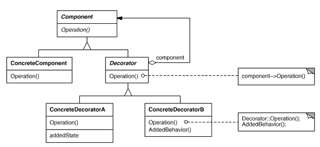

# Decorator Design Pattern

# İçerik
- [Giriş](#giriş)
    - [Ne Zaman Kullanılır?](#ne-zaman-kullanılır)
- [Örnekler](#örnekler)
    1. [Teorik Örnek (GoF Diagram)](#gof-diyagram-örnek)
    2. [Loglama Örneği](#loglama-örneği)
- [Sonuç](#sonuç)
- [Kaynakça](#kaynakça)

# Giriş

Decorator Pattern, bir nesnenin içeriğini değiştirmeden ona ek davranışlar kazandırmayı sağlar. Bir diğer adıyla Wrapper, ana nesneyi çevreleyerek ek davranışlar kazandırmayı hedefler. Decorator, decorate (süslediği/çevrelediği) nesneyle **aynı interface'i** (arayüz) uygular, bu sayede istemci kodu orijinal nesne veya decorated nesne arasında fark görmez.

## Ne Zaman Kullanılır?

- Mevcut sınıfa yeni özellik eklemek istenildiğinde, ancak sınıfın kodu değiştirilmemesi gerektiğinde kullanılır.
- Dinamik olarak run-time'da (çalışma zamanında) farklı özelliklerin eklenmesi gerektiğinde kullanılır.

# Örnekler 

<br>
Şekil 1. GoF Decorator Pattern Diagram

## GoF Diyagram Örnek
İlk örnekte direkt GoF kitabından yararlanılan diyagramın implementasyonu yapılacaktır.

Öncelikle Component interface'i ve ConcreteComponent class'ının implementasyonu gerçekleştirildi.

```
public interface IComponent
{
    string Operation();
}

public class ConcreteComponent : IComponent
{
    public string Operation()
    {
        return "ConcreteComponent";
    }
}
```

Ardından `Decorator` abstract class oluşturuldu ve hem `IComponent` interface'inden türetildi hem de `HasA` bağlantısı ile `IComponent` ile imzalanmış bir class bulundurduğu implemente edildi.

```
public abstract class Decorator : IComponent
{
    protected IComponent _component;
    public Decorator(IComponent component)
    {
        _component = component;
    }
    public virtual string Operation()
    {
        return _component.Operation();
    }
}
```

Bu `Decorator` abstract class'ını implemente edecek olan `ConcreteDecorator`'lar `Operation()` fonksiyonunu çevreleyerek eklenecek yeni özellikleri implemente edecektir.

Aşağıdaki implementasyonda görüldüğü üzere `ConcreteDecoratorA` class'ı bir boolean state (durum) belirtiyor ve state'e bağlı olarak yaptığı işlem değişiyor.

```
public class ConcreteDecoratorA : Decorator
{
    private bool _addedState = false;
    public ConcreteDecoratorA(IComponent component) : base(component)
    {
    }
    public override string Operation()
    {
        if (!_addedState)
        {
            _addedState = true;
            // Add some state or behavior
            return $"ConcreteDecoratorA: Added State ({base.Operation()})";
        }
        else
        {
            _addedState = false;
            // Remove the state or behavior
            return $"ConcreteDecoratorA: Removed State ({base.Operation()})";
        }
    }
}
```

Ek olarak ise `ConcreteDecoratorB` class'ıyla ayrı bir özellik eklenmiş olup, çıktıyı ona göre güncellemektedir.

```
public class ConcreteDecoratorB : Decorator
{
    public ConcreteDecoratorB(IComponent component) : base(component)
    {
    }

    public override string Operation()
    {
        return $"{AdditionalBehavior()} ({base.Operation()})";
    }

    public string AdditionalBehavior()
    {
        return "ConcreteDecoratorB: Additional Behavior";
    }
}
```

Yukarıdaki implementasyonların çeşitli kullanımlarını test etmek için:

```
internal class Program
{
    private static void Main(string[] args)
    {
        // Create a ConcreteComponent
        ConcreteComponent component = new ConcreteComponent();
        // Decorate it with ConcreteDecoratorA
        Decorator decoratorA = new ConcreteDecoratorA(component);
        Console.WriteLine(decoratorA.Operation());
        // Decorate it with ConcreteDecoratorB
        Decorator decoratorB = new ConcreteDecoratorB(decoratorA);
        Console.WriteLine(decoratorB.Operation());
        // Further decorate with another ConcreteDecoratorA
        Decorator decoratorC = new ConcreteDecoratorA(decoratorB);
        Console.WriteLine(decoratorC.Operation());
        Console.WriteLine("*****");
        Decorator decoratorD = new ConcreteDecoratorB(new ConcreteDecoratorA(new ConcreteDecoratorB(component)));
        Console.WriteLine(decoratorD.Operation());
        Decorator decoratorE = new ConcreteDecoratorA(decoratorD);
        Console.WriteLine(decoratorE.Operation());
    }
}
```

çıktı:
```
ConcreteDecoratorA: Added State (ConcreteComponent)
ConcreteDecoratorB: Additional Behavior (ConcreteDecoratorA: Removed State (ConcreteComponent))
ConcreteDecoratorA: Added State (ConcreteDecoratorB: Additional Behavior (ConcreteDecoratorA: Added State (ConcreteComponent)))
*****
ConcreteDecoratorB: Additional Behavior (ConcreteDecoratorA: Added State (ConcreteDecoratorB: Additional Behavior (ConcreteComponent)))
ConcreteDecoratorA: Added State (ConcreteDecoratorB: Additional Behavior (ConcreteDecoratorA: Removed State (ConcreteDecoratorB: Additional Behavior (ConcreteComponent))))
```


## Loglama Örneği


Örneğin kullanıcı girişlerini sağlayan bir `AuthService` class'ının içerisinde `Login()` methodu çalıştığında, kullanıcının bilgilerinin ve giriş yaptığı saati loglanması istenmektedir.

```
public interface IAuthService
{
    void Login(string username, string password);
}

public class AuthService : IAuthService
{
    public void Login(string username, string password)
    {
        Console.WriteLine($"User {username} logged in with password {password}.");
    }
}
```

İlgili servisin `Login` methodunu decorate edebilmek için abstract Decorator class'ı implemente edildi.
```
public abstract class AuthServiceDecorator : IAuthService
{
    private readonly IAuthService _authService;
    public AuthServiceDecorator(IAuthService authService)
    {
        _authService = authService;
    }
    public virtual void Login(string username, string password)
    {
        _authService.Login(username, password);
    }
}
```

Ardından bu `Decorator` class'ının altında concrete ve loglama isterini karşılayacak olan `LoggingConcreteDecorator` implementasyonu ile istenilen loglar service içerisinde yapılacak işlemlerin çevresine yerleştirilir.

```
public class LoggingConcreteDecorator : AuthServiceDecorator
{
    public LoggingConcreteDecorator(IAuthService authService) : base(authService) { }
    public override void Login(string username, string password)
    {
        Console.WriteLine($"Logging: Attempting to log in user {username} at {DateTime.UtcNow}.");
        base.Login(username, password);
        Console.WriteLine($"Logging: User {username} logged in successfully at {DateTime.UtcNow}.");
    }
}
```

Ardından aşağıdaki gibi kullanım örnekleri test edildiğinde:

```
internal class Program
{
    private static void Main(string[] args)
    {
        IAuthService authService = new AuthService();
        authService.Login("usernameNotDecorated", "passwordNotDecorated");
        Console.WriteLine("*******");
        IAuthService loggingAuthService = new LoggingConcreteDecorator(authService);
        loggingAuthService.Login("usernameDecorated", "DecoratedPassword");
        loggingAuthService.Login("admin", "EmopustaIsPro");
    }
}
```

Decorated ve decorate edilmeden üretilen çıktılara bakılacak olursa implementasyonun sağlıklı bir şekilde çalıştığı gözlemlenmektedir.

çıktı:
```
User usernameNotDecorated logged in with password passwordNotDecorated.
*******
Logging: Attempting to log in user usernameDecorated at 11.08.2025 15:27:13.
User usernameDecorated logged in with password DecoratedPassword.
Logging: User usernameDecorated logged in successfully at 11.08.2025 15:27:13.
Logging: Attempting to log in user admin at 11.08.2025 15:27:13.
User admin logged in with password EmopustaIsPro.
Logging: User admin logged in successfully at 11.08.2025 15:27:13.
```

# Sonuç

Bir `ConcreteComponent`'e çeşitli `Decorator` implementasyonları ile ek özellikler eklenerek genişletilebilir ve ek olarak kendi içeriğiyle ilgili hiçbir değişikliğe gerek kalmadan bu geliştirmeler  yapılabilmektedir.

# Kaynakça

Ücretsiz:
- https://www.youtube.com/watch?v=GCraGHx6gso (tavsiye edilen)
- https://refactoring.guru/design-patterns/decorator
- https://www.gencayyildiz.com/blog/c-decorator-design-patterndecorator-tasarim-deseni/?unapproved=36545&moderation-hash=5668b478f682a31ee5c628679121254f#comment-36545
- https://www.geeksforgeeks.org/system-design/decorator-pattern/

Ücretli:<br>
- [Desing Patterns: Elements of Reusable Object-Oriented Software Book](https://www.amazon.com.tr/Design-Patterns-Elements-Reusable-Object-Oriented/dp/0201633612/ref=sr_1_2?__mk_tr_TR=%C3%85M%C3%85%C5%BD%C3%95%C3%91&crid=WHUMS0DHJBKO&dib=eyJ2IjoiMSJ9.mTRaTOPYqsPcUsGD8azntQBwoQYmLa7486oAF-n21naeCMl-cWRy6Tc4xyGXPHzIe4pgk3yyBBQ5xXEXy_yChPa8_t7-ZEiWFDxX6xRvYtws2SsECY5g6_L03uQXeOL8hFzn00c2Ccjiq1EKQHmZEb4mUS1O4esM4UrdgbgWi_EB92UbzYH7rBFb5SJsRLxTch6rUKNqSfxO9I9FBaaZQoJbC04f4JZKGyaf1G6QW5xcHb7AJ4gMh3peaP8xz24u7sXUMLs7M8RIAByW4YO97lxJNs2AjFfzRyJTMtZlxpY.xPLI_w471Dn2oGOGQVdfmRuoMEX8cetRTg0iYLmadDo&dib_tag=se&keywords=design+patterns%2C&qid=1752059924&sprefix=design+pattern%2Caps%2C762&sr=8-2)
- https://www.udemy.com/course/design-patterns-csharp-dotnet/
