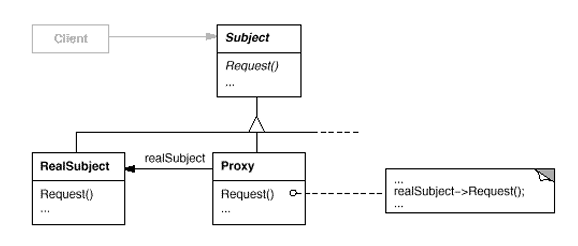

# Proxy Design Pattern
# İçerik
- [Giriş](#giriş)
- [Teori](#teori)
- [Örnekler](#örnekler)
    1. [Remote Proxy](#1-remote-proxy-1)
    2. [Virtual Proxy](#2-virtual-proxy-1)
    3. [Remote Proxy](#3-protection-proxy-1)
    4. [Remote Proxy](#4-smartreference-proxy)
- [Sonuç](#sonuç)
- [Bonus](#bonus)
- [Kaynakça](#kaynakça)

# Giriş

Proxy Pattern, bazı nesnelerin (RealSubject) işlevlerinin başka bir  Proxy nesnesi üzerinden erişim yapılmasını sağlayarak, bu nesnelere doğrudan erişimi kısıtlar. Bu sayede:

- Nesnelerin gereksiz yere oluşturulması veya kullanılması engellenebilir (örneğin, Lazy Initialization),
- Yetkilendirme ve erişim kontrolü gibi güvenlik mekanizmaları eklenebilir,
- Ağ, önbellekleme veya kaynak yönetimi gibi işlemler optimize edilebilir,
- Uzaktaki (remote) nesnelerle iletişim soyutlanabilir.

Bir diğer adıyla Surrogate olan bu Pattern, gerçek nesneye olan erişimi kontrol ederek hem sistem performansını hem de güvenliğini artırmak için kullanılır. Proxy Pattern’in Virtual Proxy, Protection Proxy, Remote Proxy, Smart Reference ve Caching Proxy gibi farklı alt türleri bulunmaktadır.

### 1. Remote Proxy
Uzak bir nesneye local bir temsilci sağlayarak, gerekli kontroller sağlandıktan sonra uzaktaki nesneye isteğin gönderilmesini sağlar.
### 2. Virtual Proxy
Maliyetli ve büyük nesnelerin talep edildiği zaman (on demand) kullanılmasını sağlar.
### 3. Protection Proxy
Gerçek nesneye olan erişimi kontrol eder. Nesnelerin farklı roller ile erişilmesi gerektiği durumlarda kullanışlı çözümler sunar.
### 4. Smart Reference
Nesneye erişim miktarını tutma, nesneye ilk erişildiğinde nesneyi bellekte saklama, başka bir nesnenin gerçek nesneyi değiştirememesi için gerçek nesneyi lock'lama (kilit) gibi işlemleri yapar.
### 5. Caching Proxy
Smart Reference'da uygulanan nesneyi bellekte saklama işlemini yapmaktadır. Böylece tekrarlı kullanılan nesnelerin, sürekli olarak generate edilmemesini sağlar. Bazı kaynaklarda Smart Reference adı altında geçmektedir.

## Teori
Görsel 1'deki şema incelenecek olursa aynı `ISubject` interface'inden (arayüz) implement olan iki farklı concrete class (sınıf) bulunmaktadır. `RealSubject` class'ı yapılacak olan gerçek işin implementasyonunu barındırır, `Proxy` class'ı ise `RealSubject` class'ıyla kurulacak etkileşimi kontrol edecek olan implementasyonlar ile birlikte `RealSubject` class'ındaki ilgili methodu çağırır ve HasA ilişkisi ile `Proxy` içerisinde saklanır.

<br>
Görsel 1. GoF kitabından alınan Proxy Pattern diyagramı
# Örnekler

`ISubject` ve `RealSubject` implementasyonları değişmeyeceğinden her örnekte tekrarlanmaması için aşağıda verilmiştir.

```
public interface ISubject
{
    void Request();
}

public class RealSubject : ISubject
{
    public void Request()
    {
        Console.WriteLine("RealSubject: Handling request.");
    }
}
```

## 1. Remote Proxy

Bu varyasyonda, uzaktaki bir `Subject`'e erişmeden önce belirli kontroller sağlanması ve daha sonrasında ilgili `RealSubject`'e request'in (istek) iletilmesi sağlanır.

```
public class RemoteProxy : ISubject
{
    private readonly RealSubject _realSubject;
    public RemoteProxy(RealSubject realSubject)
    {
        _realSubject = realSubject;
    }
    public void Request()
    {
        Console.WriteLine("Some process...");
        Console.WriteLine("RemoteProxy: Forwarding request to RealSubject.");
        _realSubject.Request();
    }
}
```

```
internal class Program
{
    private static void Main(string[] args)
    {
        // Create a RealSubject instance
        RealSubject realSubject = new RealSubject();
        // Create a RemoteProxy instance that surrogates the RealSubject
        RemoteProxy remoteProxy = new RemoteProxy(realSubject);
        // Use the RemoteProxy to handle requests
        remoteProxy.Request();
    }
}
```
çıktı:
```
Some process...
RemoteProxy: Forwarding request to RealSubject.
RealSubject: Handling request.
```

## 2. Virtual Proxy

Bu varyasyonda, initialize edilecek olan `RealSubject`'in çok maliyetli olmasından kaynaklı `Lazy Loading` yapmayı sağlayan bir implementasyon sağlar. Böylece, maliyetli işlemler on-demand (talep edildiğinde) kullanılır ve maliyeti düşük işlemler aradan çıkartılabilir.

```
public class VirtualProxy : ISubject
{
    private RealSubject? _realSubject;

    public void Request()
    {
        if (_realSubject == null)
        {
            Console.WriteLine("VirtualProxy: Creating RealSubject instance.");
            _realSubject = new RealSubject();
        }
        Console.WriteLine("VirtualProxy: Forwarding request to RealSubject.");
        _realSubject.Request();
    }
}
```

```
internal class Program
{
    private static void Main(string[] args)
    {
        // Create a VirtualProxy instance that wraps the RealSubject
        VirtualProxy virtualProxy = new VirtualProxy();
        // Use the VirtualProxy to handle requests
        virtualProxy.Request();
    }
}
```

çıktı:
```
VirtualProxy: Creating RealSubject instance.
VirtualProxy: Forwarding request to RealSubject.
RealSubject: Handling request.
```

## 3. Protection Proxy

Bu varyasyonda, `RealSubject` içerisindeki methoda erişilmeden önce security (güvenlik) işlemlerinin yapılması hedeflenir. Örneğin bu methoda istek atan bir kullanıcının rolünün kontrolü.

```
public class ProtectionProxy : ISubject
{
    private RealSubject? _realSubject;
    private readonly string _userRole;
    public ProtectionProxy(string userRole)
    {
        _userRole = userRole;
    }
    public void Request()
    {
        if (_userRole == "Admin")
        {
            if (_realSubject == null)
            {
                Console.WriteLine("ProtectionProxy: Creating RealSubject instance.");
                _realSubject = new RealSubject();
            }
            Console.WriteLine("ProtectionProxy: Forwarding request to RealSubject.");
            _realSubject.Request();
        }
        else
        {
            Console.WriteLine("ProtectionProxy: Access denied for non-admin users.");
        }
    }
}
```

```
internal class Program
{
    private static void Main(string[] args)
    {
        // Create a protection proxy for an admin user
        ISubject adminProxy = new ProtectionProxy("Admin");
        adminProxy.Request();
        Console.WriteLine("***************");
        // Create a protection proxy for a non-admin user
        ISubject userProxy = new ProtectionProxy("User");
        userProxy.Request();
    }
}
```

çıktı:
```
ProtectionProxy: Creating RealSubject instance.
ProtectionProxy: Forwarding request to RealSubject.
RealSubject: Handling request.
***************
ProtectionProxy: Access denied for non-admin users.
```

Çıktıda da görüldüğü üzere kullanıcı `Admin` olmaması durumunda request başarısız olmaktadır.

## 4. SmartReference Proxy

Bu varyasyonda, metinde bahsedilen özelliklerden request miktarının sayılması kontrolünün yapıldığı bir örnek implemente edilmiştir.

```
public class SmartReferenceProxy : ISubject
{
    private RealSubject _realSubject;
    private int _referenceCount = 0;
    public SmartReferenceProxy(RealSubject realSubject)
    {
        _realSubject = realSubject;
    }
    public void Request()
    {
        _referenceCount++;
        Console.WriteLine($"SmartReferenceProxy: Forwarding request to RealSubject. Reference count: {_referenceCount}");
        _realSubject.Request();
    }
}
```

```
internal class Program
{
    private static void Main(string[] args)
    {
        // Create a RealSubject instance
        RealSubject realSubject = new RealSubject();
        // Create a SmartReferenceProxy instance that surrogates the RealSubject
        SmartReferenceProxy smartReferenceProxy = new SmartReferenceProxy(realSubject);
        // Use the SmartReferenceProxy to handle requests
        smartReferenceProxy.Request();
        smartReferenceProxy.Request(); 
        smartReferenceProxy.Request(); 
        smartReferenceProxy.Request(); 
    }
}
```

çıktı:
```
SmartReferenceProxy: Forwarding request to RealSubject. Reference count: 1
RealSubject: Handling request.
SmartReferenceProxy: Forwarding request to RealSubject. Reference count: 2
RealSubject: Handling request.
SmartReferenceProxy: Forwarding request to RealSubject. Reference count: 3
RealSubject: Handling request.
SmartReferenceProxy: Forwarding request to RealSubject. Reference count: 4
RealSubject: Handling request.
```

Çıktıda da görüldüğü üzere `RealSubject`'in initialize edilmesinden sonra atılan her requestte referans sayısının bir arttırılmıştır.
# Sonuç

Sonuç olarak, Proxy Pattern implementasyonu ana işin yapılmasını kontrol edici bir ön kontrol mekanizması sunmaktadır. Implementasyonel olarak başka patternlere benzediği çokça tartışılmaktadır. Bu tartışmalara cevap olarak, amaca yönelik ayrım söz konusu olduğundan kaynaklı bu ayrım yapılabilmektedir ve pattern'lerin sadece implementasyonlarına bakılarak hangi pattern olduklarına karar verilmemelidir.

# Bonus

SOLID'in Open-closed principle'ına bakılacak olursa bu pattern sayesinde var olan kodda değişiklik yapmadan, o kodun özelliklerini genişletilebilmesi sağlanmaktadır. Yukarıdaki yapılanlara ek olarak tek yapılması gereken IoC container içerisindeki `<IRequest, RealSubject>` service registration'unu `<IRequest, Proxy>` ile güncellenmesi ve böylece işlem tamamlanmış olur. 
Örnek makaleye [buradan](https://brokul.dev/proxy-pattern-in-c-an-easy-way-to-extend-production-code) ulaşılabilir.

# Kaynakça

https://www.youtube.com/watch?v=NwaabHqPHeM (önerilen)
https://brokul.dev/proxy-pattern-in-c-an-easy-way-to-extend-production-code
https://refactoring.guru/design-patterns/proxy
https://medium.com/kodcular/proxy-design-pattern-nedir-a842de9605b6
https://how.dev/answers/what-is-the-virtual-proxy-design-pattern
https://java-design-patterns.com/patterns/virtual-proxy/#real-world-applications-of-virtual-proxy-pattern-in-java
https://dev.to/sergeyleschev/swift-design-patterns-virtual-proxy-2bbg